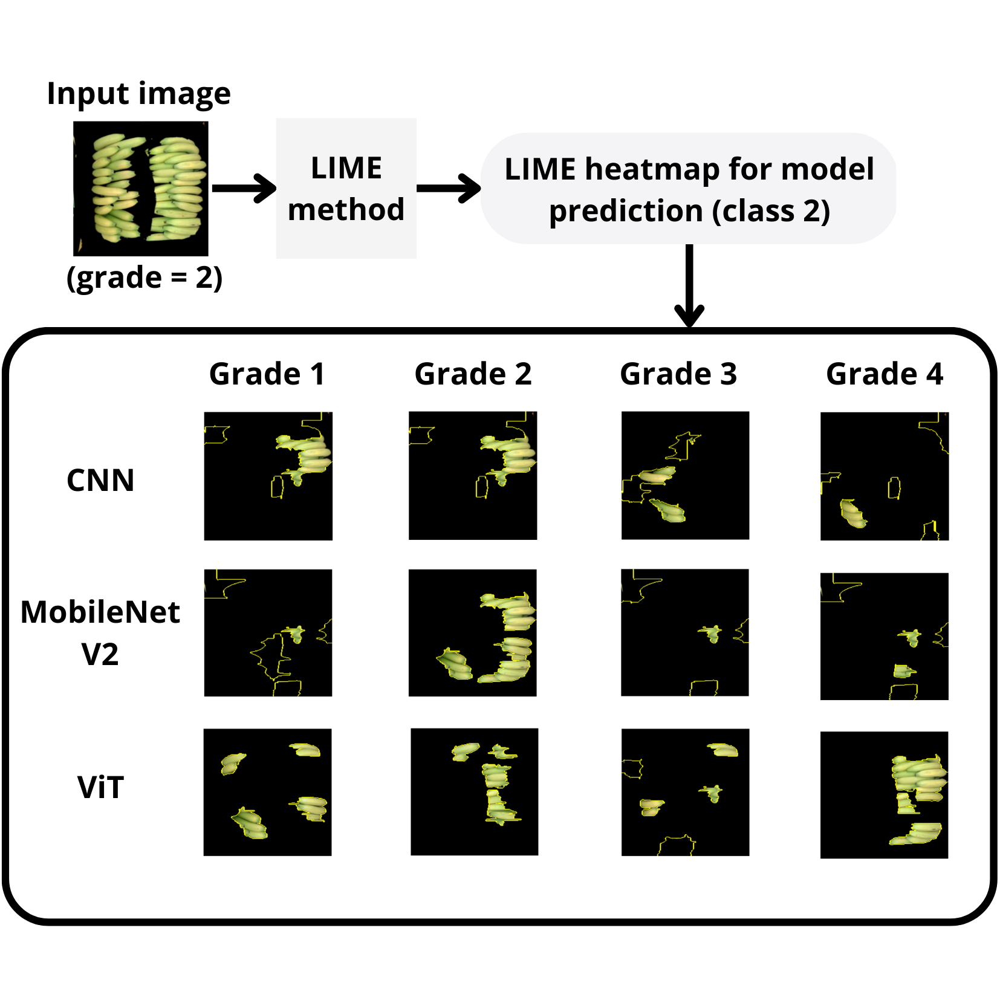

# Explainable Fruit Ripeness Classification

This repository contains the code related to the paper "Stop overkilling simple tasks with black-box models and use
transparent models instead", which has been submitted to ITNNS.

# Method

We compare accuracy and explainability for the banana ripeness classification task (from 1, under-ripe, to 4, over-ripe)
using four different models.
Three of these models are neural networks operating on raw data:

* Vanilla CNN (**CNN**)
* **MobileNet V2**
* Vision Transformer (**ViT**)

We try to explain these models using the model agnostic approaches
called [LIME](https://dl.acm.org/doi/10.1145/2939672.2939778) and [SHAP](https://arxiv.org/abs/1705.07874). Albeit
intuitive, the explanations produced by these methods do not seem human-intelligible.

We compare the deep learning approach to a simple **decision tree** working on the average RGB channels of the input
images, that reaches comparable accuracy while offering more room for explainability. Namely, we design the
explainability of the model toegether with the model itself. Thus, we can propose as explanation a mapping between the
regions of the RGB color space the decision tree associates with each class and the RGB values of some input.

# Results on Accuracy

# Reproducibility

The code in this repository is based on the [PyTorch](https://pytorch.org/) machine learning framework.

## Requirements

To install the required packages, please run `pip3 install -r requirements` within the root folder of the project.

## Accessing the Dataset

To download the dataset that was used for the experiments reported in the paper please use the following link:

## Running the Deep Learning Models

To train the three deep learning models available, please run `python3 classifiers/deep_learning/main.py`. The run can
be configured by editing the yaml files within the `classifiers/deep_learning/params` folder. To choose from the three
deep learning model please edit the network type in the `experiment.yml` file.

### Explanation Methods

To run either LIME or SHAP please refer to the main.py at `python3 classifiers/deep_learning/explainability/main.py`.

## Running the Decision Tree

To train the decision tree, please run `python3 classifiers/decision_tree/main.py`. The run can be configured by editing
the yaml files within the `classifiers/decision_tree/params` folder. To choose the parameters for the decision tree,
edit them in the `experiment.yml` file.

### Explanation Method

To explain the decision tree please follow these commands:

* `python3 segmentation/main.py` to segment out the background of the fruit;
* `python3 classifiers/decision_tree/scripts/average_color.py` to compute the average color of each image in the
  segmented dataset;
* `python3 classifiers/decision_tree/scripts/standardize_luma.py` to standardize the luminosity of the image based on
  the Y channel of the YUV color space;
* `python3 classifiers/decision_tree/scripts/explain.py` to generate the explanations.
